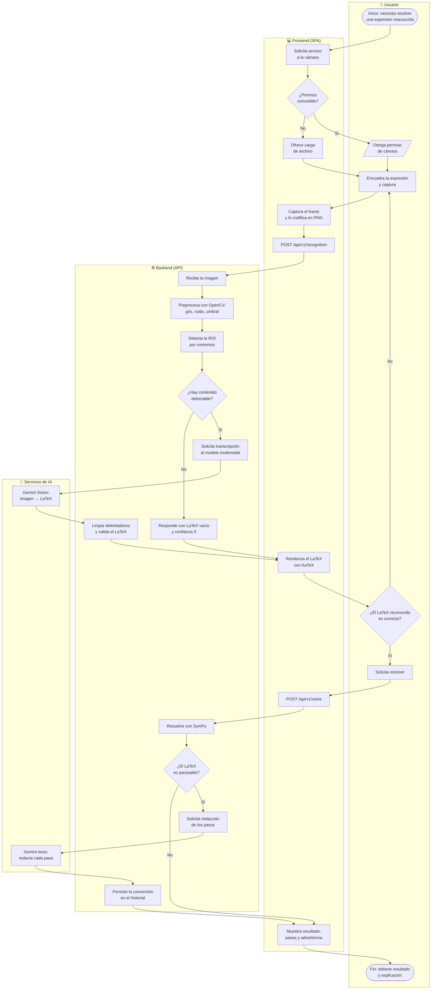
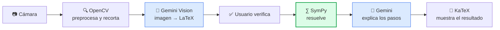

# BPMN — Proceso de conversión y resolución

**Responsable:** Michael Ramírez (Product Owner)
**Versión:** 1.0 — 20 de julio de 2026

Modelo del proceso de negocio de una conversión completa, desde que el usuario
apunta la cámara hasta que recibe el resultado explicado. Los diagramas usan
mermaid para que se rendericen directamente en GitHub.

---

## 1. Diagrama del proceso (con carriles)



## 2. Descripción de las actividades

### Carril del usuario

| Actividad | Descripción |
|---|---|
| **Otorga permiso de cámara** | El navegador solicita consentimiento explícito. Es el punto de control de privacidad: sin acción afirmativa del usuario no se accede a la cámara |
| **Encuadra y captura** | El usuario decide qué entra en la imagen. Se le indica encuadrar solo la expresión, lo que reduce el riesgo de capturar datos personales del entorno |
| **Verifica el LaTeX** | Punto de control de calidad. El usuario confirma que lo transcrito corresponde a lo que escribió, antes de que el sistema invierta una llamada en resolverlo |
| **Solicita resolver** | Acción deliberada, no automática: evita gastar cuota de API en reconocimientos que el usuario ya descartó |

### Carril del frontend

| Actividad | Descripción |
|---|---|
| **Solicita acceso a la cámara** | `getUserMedia`. Requiere contexto seguro (HTTPS), garantizado por el despliegue |
| **Captura el frame** | Se dibuja el fotograma en un `canvas` y se exporta a PNG. El vídeo **nunca se transmite**: sólo viaja la imagen fija que el usuario eligió |
| **Renderiza con KaTeX** | Con `throwOnError: false`, de modo que un LaTeX imperfecto se muestre degradado en lugar de romper la interfaz |
| **Muestra resultado y advertencia** | Junto al resultado se recuerda verificarlo, por tratarse de un contexto educativo |

### Carril del backend

| Actividad | Descripción |
|---|---|
| **Preprocesa con OpenCV** | Escala de grises, reducción de ruido y umbral adaptativo. Compensa las condiciones reales de una foto de cuaderno: sombras, iluminación desigual, papel amarillento |
| **Detecta la ROI** | `findContours` localiza los trazos, descarta el ruido pequeño y calcula el rectángulo que engloba la expresión. Recortar el fondo mejora la transcripción y reduce tokens de imagen |
| **Solicita transcripción** | El prompt restringe la respuesta a LaTeX puro, sin explicar ni resolver |
| **Limpia y valida** | Se retiran delimitadores (```` ```latex ````, `$$`) que el modelo añade de forma intermitente y que romperían el parseo de SymPy |
| **Resuelve con SymPy** | **Actividad crítica del proceso.** El resultado se calcula de forma determinista; el modelo de lenguaje no participa en el cálculo |
| **Solicita redacción de pasos** | El modelo narra en lenguaje natural los pasos que SymPy ya produjo. No puede alterar los valores |
| **Persiste la conversión** | Sólo para usuarios autenticados y sin almacenar la imagen original |

## 3. Puntos de decisión y manejo de excepciones

| # | Decisión | Camino alternativo | Justificación |
|---|---|---|---|
| 1 | ¿Permiso de cámara concedido? | Se ofrece carga de archivo | La aplicación nunca queda inutilizable por una denegación de permiso |
| 2 | ¿Hay contenido detectable en la imagen? | Se responde con LaTeX vacío y confianza 0 | Evita gastar una llamada al modelo en una imagen en blanco o ilegible |
| 3 | ¿El LaTeX reconocido es correcto? | El usuario repite la captura | Barrera contra el riesgo R‑01: resolver correctamente el problema equivocado |
| 4 | ¿El LaTeX es parseable por SymPy? | Se devuelve resultado vacío con aviso | Preferible admitir que no se pudo resolver a inventar un resultado |

Fallos no modelados como decisión, resueltos por degradación controlada:

- **El servicio de IA no responde o falta la clave** → el reconocimiento devuelve
  LaTeX vacío y la interfaz ofrece reintentar; la API nunca devuelve un 500 por
  esta causa.
- **La redacción de los pasos falla** → se muestran los pasos de SymPy sin
  enriquecer. Se pierde la narración, no la corrección.

## 4. Vista simplificada (flujo feliz)

Versión resumida para la sustentación:



En verde, la única actividad que determina el **valor** del resultado; en azul,
las que aportan **lectura y redacción**. Esa separación es la decisión de diseño
central del sistema: el modelo de lenguaje nunca calcula.

---

## Referencias

- [`../product/problem-definition.md`](../product/problem-definition.md) — alcance y flujo esperado.
- [`c4-architecture.md`](./c4-architecture.md) — vista estructural del mismo sistema.
