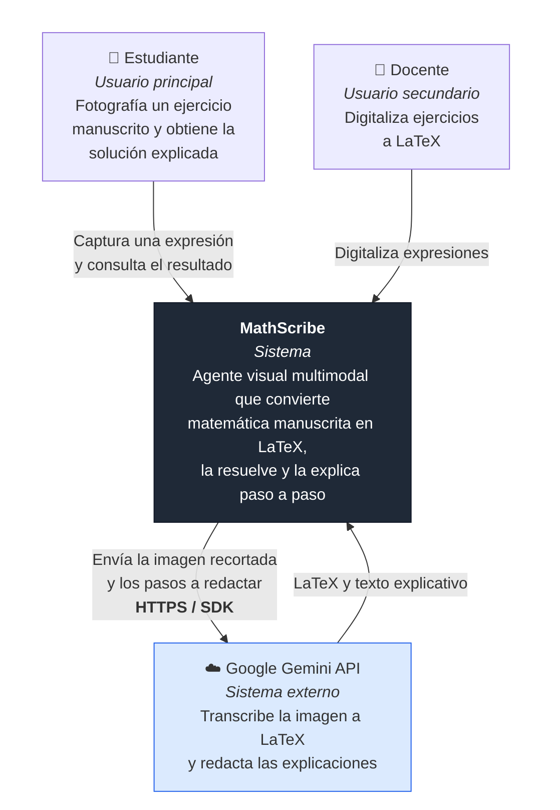
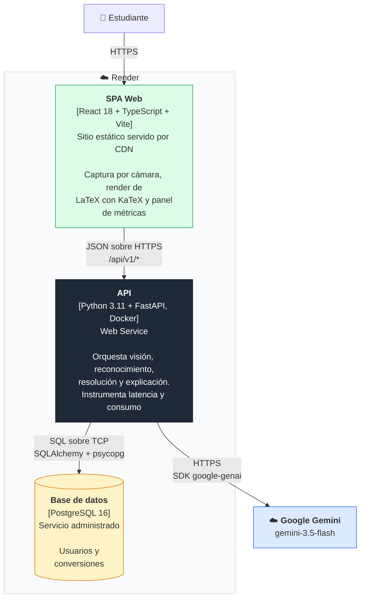
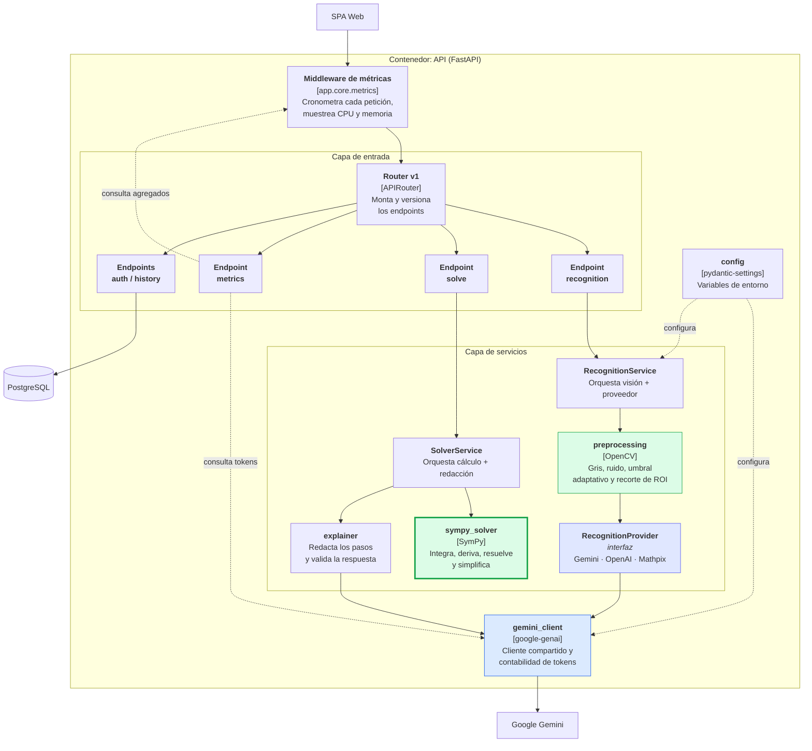
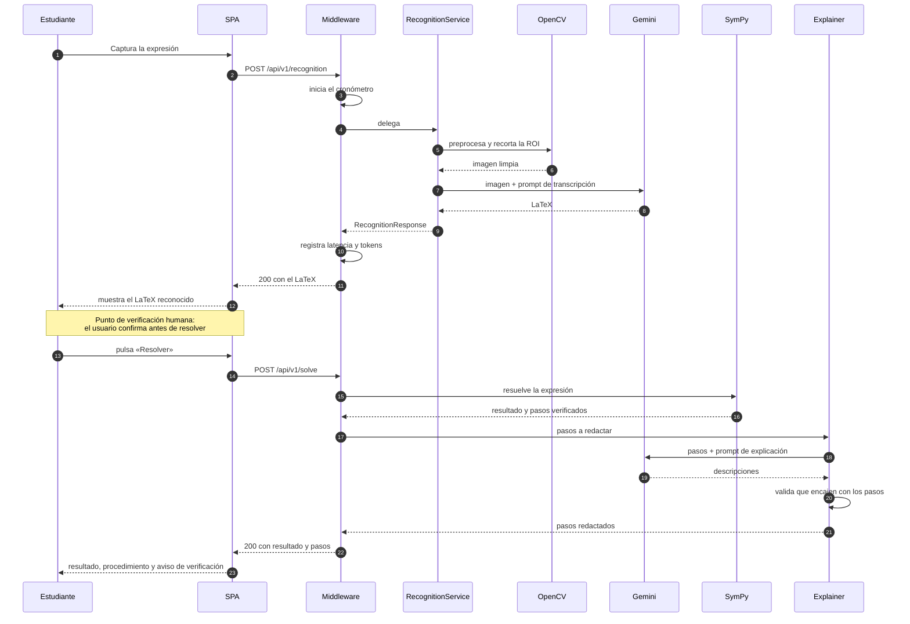

# Arquitectura C4 — MathScribe

**Responsable:** Daniel Rojas Barreneche (Arquitectura / DevOps)
**Versión:** 1.0 — 21 de julio de 2026

Descripción de la arquitectura en los tres primeros niveles del modelo C4:
contexto, contenedores y componentes. Los diagramas reflejan el sistema tal
como está construido y desplegado, no un diseño previo.

---

## Nivel 1 — Contexto

Qué es MathScribe y con quién habla.

**Decisión de contexto:** el único sistema externo es Gemini. No hay
integraciones con plataformas educativas ni servicios de autenticación de
terceros; reduce la superficie de dependencia y el alcance del tratamiento de
datos personales.

---

## Nivel 2 — Contenedores

Las piezas desplegables y cómo se comunican.

### Justificación de la separación

| Contenedor | Por qué está separado |
|---|---|
| **SPA estática** | No necesita servidor de aplicación: se sirve desde CDN, escala sin costo y aísla los fallos del backend de la disponibilidad de la interfaz |
| **API en Docker** | Requiere Python con OpenCV y SymPy, dependencias nativas que exigen una imagen controlada. El contenedor garantiza que lo que corre en producción es lo mismo que en desarrollo |
| **PostgreSQL administrado** | Los datos son relacionales (usuario → conversiones) y delegar la operación evita gestionar respaldos y actualizaciones |

**Nota sobre el estado:** la API es **sin estado** salvo por el registro de
métricas, que vive en memoria del proceso y se reinicia con él. Es una decisión
consciente de alcance, documentada en `cloud-native.md`: mantener un histórico
exigiría infraestructura de observabilidad fuera del alcance del proyecto.

---

## Nivel 3 — Componentes de la API

El interior del contenedor que concentra la lógica.

En verde, los componentes que ejecutan **cómputo propio y determinista**
(OpenCV y SymPy); en azul, los que dependen del modelo externo. La frontera
entre ambos es la garantía central del sistema: **el resultado matemático se
calcula en verde y sólo se narra en azul**.

### Responsabilidad de cada componente

| Componente | Responsabilidad | Por qué está aislado |
|---|---|---|
| `preprocessing` | Limpieza y detección de ROI con OpenCV | Cumple el requisito de visión open source y es sustituible sin tocar el resto |
| `RecognitionProvider` | Contrato imagen → LaTeX | Permite cambiar de proveedor de IA sin modificar la API ni el frontend. Es la mitigación del riesgo de dependencia externa |
| `gemini_client` | Cliente y contabilidad de tokens | Único punto por el que pasan las llamadas al modelo, lo que hace fiable la medición de consumo |
| `sympy_solver` | Cálculo simbólico | Fuente de verdad del resultado. No depende de ningún servicio externo |
| `explainer` | Redacción y **validación** de la respuesta | Descarta explicaciones que no encajen con los pasos calculados |
| `metrics` | Instrumentación transversal | Middleware: mide sin que los endpoints tengan que colaborar |

---

## Flujo de una petición completa

---

## Decisiones arquitectónicas relevantes

| # | Decisión | Alternativa descartada | Motivo |
|---|---|---|---|
| 1 | El cálculo lo hace SymPy, no el modelo | Pedirle a Gemini que resuelva | Convierte el resultado en determinista y verificable; elimina la alucinación matemática por diseño |
| 2 | Reconocimiento tras una interfaz | Llamar a Gemini directamente desde los endpoints | Cambiar de proveedor no toca la API ni el frontend |
| 3 | Dos endpoints (reconocer y resolver) en vez de uno | Un único endpoint de extremo a extremo | Habilita la verificación humana intermedia y evita gastar cuota resolviendo transcripciones incorrectas |
| 4 | Frontend estático, sin renderizado en servidor | Next.js con SSR | No hay necesidad de SEO ni de datos en el servidor; abarata y simplifica el despliegue |
| 5 | Métricas en memoria del proceso | Prometheus o similar | Suficiente para caracterizar el sistema en una sesión; la infraestructura completa excede el alcance |
| 6 | Degradación en lugar de error | Propagar 500 ante fallo del modelo | Una API caída por un tercero es peor experiencia que una respuesta vacía con aviso |

---

## Referencias

- [`cloud-native.md`](./cloud-native.md) — topología de despliegue y principios operativos.
- [`bpmn.md`](./bpmn.md) — el mismo flujo desde la perspectiva de proceso de negocio.
- [`../devops/despliegue-y-permisos.md`](../devops/despliegue-y-permisos.md) — configuración real del despliegue.
