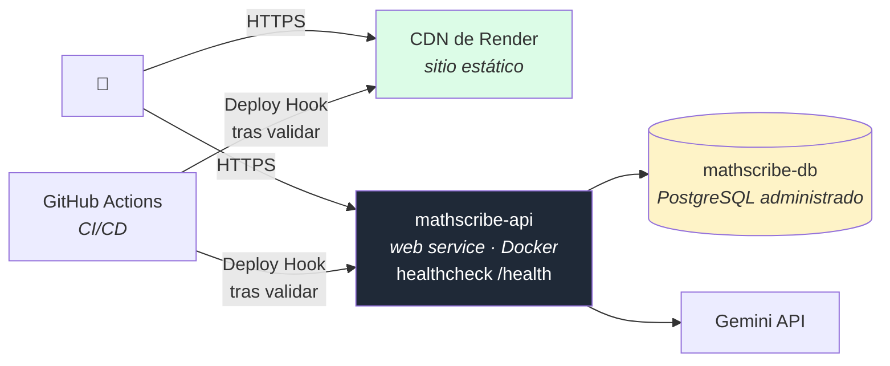

# Arquitectura cloud-native — MathScribe

**Responsable:** Daniel Rojas Barreneche (Arquitectura / DevOps)
**Versión:** 1.0 — 21 de julio de 2026

Cómo se aplican los principios de una aplicación cloud-native al sistema, qué
está efectivamente implementado y qué queda declarado como límite conocido.

---

## 1. Topología de despliegue

Tres recursos gestionados por la plataforma, ninguno servidor administrado por
el equipo. El sistema no depende de ninguna máquina concreta: se reconstruye
entero desde el repositorio.

## 2. Los doce factores

Evaluación honesta, señalando lo que no se cumple:

| # | Factor | Estado | Cómo |
|---|---|---|---|
| 1 | **Código base** | ✅ | Un repositorio por contenedor desplegable, con historial completo |
| 2 | **Dependencias** | ✅ | Declaradas y acotadas en `requirements.txt` y `package-lock.json`. La imagen Docker no depende de nada preinstalado en el anfitrión |
| 3 | **Configuración** | ✅ | Todo por variables de entorno vía `pydantic-settings`; ningún valor de entorno en el código. `.env` está en `.gitignore` |
| 4 | **Backing services** | ✅ | PostgreSQL y Gemini son recursos externos direccionados por URL o clave; sustituirlos es cambiar una variable |
| 5 | **Build, release, run** | ✅ | Separadas: el pipeline construye y valida, el Deploy Hook publica, Render ejecuta |
| 6 | **Procesos sin estado** | ⚠️ | La API es sin estado **salvo el registro de métricas**, que vive en memoria. Ver §4 |
| 7 | **Vinculación a puertos** | ✅ | Uvicorn expone el 8000; la plataforma enruta |
| 8 | **Concurrencia** | ⚠️ | El proceso es asíncrono y escala horizontalmente, pero el plan gratuito no permite réplicas. Ver §4 |
| 9 | **Desechabilidad** | ✅ | Arranque en segundos; sin trabajo en curso que perder al terminar |
| 10 | **Paridad dev/prod** | ✅ | La misma imagen Docker en ambos entornos; `docker-compose` reproduce la base de datos en local |
| 11 | **Logs como flujo** | ✅ | Se escriben a stdout con formato estructurado por petición; la plataforma los recoge |
| 12 | **Procesos administrativos** | ⚠️ | Las tablas se crean al arrancar en lugar de con migraciones versionadas. Ver §4 |

## 3. Propiedades cloud-native implementadas

**Contenerización.** La API se empaqueta con `infra/Dockerfile` sobre
`python:3.11-slim`. Las dependencias se instalan antes de copiar el código, de
modo que un cambio en el código no invalida la capa de dependencias y las
reconstrucciones son rápidas.

**Salud observable.** `/health` responde sin tocar la base de datos, para que un
problema de conexión no marque el servicio como caído cuando en realidad puede
seguir sirviendo el flujo principal —que no necesita base de datos.

**Configuración externalizada.** Ninguna URL, clave ni tarifa está incrustada.
`config.py` normaliza además lo que la plataforma entrega en un formato distinto
al esperado: la cadena de conexión sin driver explícito y los orígenes CORS como
texto plano en lugar de lista.

**Despliegue automatizado y condicionado.** El pipeline sólo publica lo que pasó
lint, pruebas y el umbral de cobertura. Esto es más estricto que el auto-deploy
nativo de la plataforma, que publicaría cualquier commit que llegue a `main`.

**Degradación controlada.** Si Gemini falla o falta la clave, el reconocimiento
devuelve vacío y la explicación conserva los pasos de SymPy; la resolución
simbólica sigue funcionando sin ninguna credencial. **El sistema pierde
capacidades, no disponibilidad.**

**Aislamiento de fallos entre contenedores.** El frontend es estático: si la API
cae, la interfaz sigue cargando y comunica el error, en lugar de mostrar una
página en blanco.

## 4. Límites conocidos

Cuatro puntos donde el sistema no es plenamente cloud-native, con la decisión
que hay detrás:

**Métricas en memoria (factor 6).** Los contadores se reinician con el proceso y
no se comparten entre réplicas. Es suficiente para caracterizar el sistema en una
sesión de uso o una demostración; un histórico real exigiría Prometheus o un
servicio equivalente, fuera del alcance del proyecto. Con varias réplicas, cada
una reportaría sólo su propio tráfico.

**Sin réplicas (factor 8).** El plan gratuito ejecuta una sola instancia. La
aplicación **está preparada** para escalar horizontalmente —es asíncrona y no
guarda sesión—, con la salvedad de las métricas.

**Esquema sin migraciones (factor 12).** Las tablas se crean al arrancar en lugar
de gestionarse con Alembic. Es una decisión de alcance tomada por el calendario:
funciona para un esquema que no ha cambiado, pero no permite evolucionarlo de
forma segura en producción.

**Suspensión por inactividad.** Los servicios gratuitos se detienen tras 15
minutos sin tráfico y tardan entre 30 y 60 segundos en despertar. Es una
limitación del plan, no del diseño, pero **condiciona la demostración en vivo**:
conviene abrir la aplicación unos minutos antes.

## 5. Evolución hacia un entorno productivo

En orden de prioridad, si el proyecto continuara:

1. **Migraciones con Alembic** — es el límite más serio: sin ellas, cualquier
   cambio de esquema arriesga los datos.
2. **Métricas a un sistema de observabilidad** — habilita el escalado horizontal
   real y conserva el histórico.
3. **Réplicas con autoescalado** — inmediato una vez resuelto el punto anterior.
4. **Restringir el endpoint de métricas** — ver `../responsible-ai/responsible-ai.md` §7.1.
5. **Caché de reconocimientos** — la misma imagen produce el mismo LaTeX; una
   caché por hash del contenido reduciría costo y latencia.

---

## Referencias

- [`c4-architecture.md`](./c4-architecture.md) — estructura del sistema.
- [`../devops/despliegue-y-permisos.md`](../devops/despliegue-y-permisos.md) — configuración real y secretos.
- `infra/Dockerfile`, `render.yaml`, `.github/workflows/ci.yml` — la implementación.
