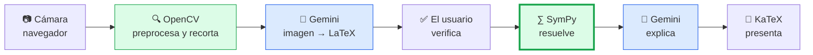

# Documento técnico — MathScribe

**Agente visual multimodal para matemática manuscrita**

**Equipo:** José Adrián Marín · María Alejandra Moya · Michael Ramírez ·
Juan Fernando Calle · Daniel Rojas Barreneche
**Curso:** Proyecto Integrador 2 — Universidad del Valle
**Fecha:** 21 de julio de 2026

---

## Resumen

MathScribe convierte una fotografía de matemática manuscrita en notación LaTeX,
resuelve la expresión y explica el procedimiento paso a paso. El flujo es
**cámara → OpenCV → Gemini → SymPy → explicación**, desplegado públicamente con
integración y despliegue continuos.

La decisión que define el sistema es que **el modelo de lenguaje nunca calcula**.
Lee la imagen y redacta las explicaciones; la matemática la resuelve SymPy, un
motor simbólico determinista. Eso convierte el resultado en verificable en lugar
de probabilístico, y elimina por diseño el riesgo de que una alucinación llegue
al usuario con apariencia de respuesta correcta.

---

## 1. Problema

La matemática se sigue produciendo a mano, pero las herramientas digitales que
podrían ayudar sólo entienden texto estructurado. Cruzar esa frontera exige
transcribir a LaTeX: lento, propenso a errores y con una barrera de conocimiento
que deja fuera precisamente a quien más ayuda necesita.

Las soluciones existentes cubren tramos sueltos: las calculadoras simbólicas
resuelven pero exigen teclear; los OCR matemáticos transcriben pero no explican;
los asistentes generales aceptan una foto pero responden con texto generado
probabilísticamente, que **puede equivocarse con total seguridad aparente**.

MathScribe aborde las dos cosas: elimina la fricción de transcripción y garantiza
que el resultado sea verificable.

**Público objetivo:** estudiantes de secundaria y universidad (primario),
docentes que digitalizan material (secundario) y personas con dificultades para
teclear notación compleja (terciario).

Detalle completo, alcance y exclusiones en
[`product/problem-definition.md`](./product/problem-definition.md).

## 2. Arquitectura

### Visión general



En verde, cómputo propio y determinista; en azul, el modelo externo. **La
frontera entre ambos colores es la garantía de corrección del sistema.**

### Contenedores

| Contenedor | Tecnología | Rol |
|---|---|---|
| SPA Web | React 18 + TypeScript + Vite, sitio estático | Captura, presentación y panel de métricas |
| API | Python 3.11 + FastAPI, en Docker | Orquesta visión, reconocimiento, resolución y explicación |
| Base de datos | PostgreSQL 16 administrado | Usuarios y conversiones |
| Servicio externo | Gemini 3.5 Flash | Transcripción y redacción |

Los tres niveles del modelo C4, el flujo detallado de una petición y las seis
decisiones arquitectónicas relevantes están en
[`design/c4-architecture.md`](./design/c4-architecture.md); la evaluación
cloud-native y los doce factores, en
[`design/cloud-native.md`](./design/cloud-native.md).

### Por qué dos endpoints y no uno

`POST /recognition` y `POST /solve` están separados deliberadamente. Un único
endpoint de extremo a extremo habría sido más simple, pero impide el punto de
verificación humana: el usuario ve el LaTeX reconocido **antes** de que el
sistema resuelva. Sin esa pausa, un error de transcripción produce la solución
correcta de un problema equivocado — el fallo más peligroso del sistema, porque
el resultado parece impecable.

## 3. Estrategia multimodal

El sistema hace dos llamadas al modelo, con roles estrictamente acotados:

| Llamada | Se le pide | Se le prohíbe |
|---|---|---|
| Reconocimiento | Transcribir la imagen a LaTeX | Resolver, simplificar, interpretar |
| Explicación | Redactar pasos ya calculados | Recalcular, añadir o quitar pasos |

**La imagen que recibe el modelo no es la foto original.** OpenCV la convierte a
escala de grises, reduce el ruido, aplica umbral adaptativo y detecta la región
de interés por análisis de contornos, enviando sólo esa región. Esto mejora la
precisión, reduce el costo —menos píxeles, menos tokens— y limita la exposición
de datos personales que pudiera haber en el resto de la hoja.

## 4. Prompting

Los prompts son parte del contrato con SymPy, no redacción decorativa: si se
relajan, el parseo aguas abajo se rompe. Por eso hay pruebas automatizadas que
fijan sus invariantes.

Ninguna respuesta del modelo se usa tal cual:

- **Reconocimiento:** se limpian iterativamente los delimitadores que el modelo
  añade pese a prohibírselo (el prompt reduce la frecuencia, el código garantiza
  el resultado).
- **Explicación:** se exige un arreglo JSON con exactamente un texto por paso.
  Ante el mínimo desajuste se descarta la respuesta completa y se conservan las
  descripciones originales. **Emparejar mal las explicaciones sería peor que no
  explicar**, porque produciría un texto convincente y erróneo.

Prompts completos, justificación de cada regla y restricciones del modelo en
[`design/prompting-strategy.md`](./design/prompting-strategy.md).

## 5. Métricas y desempeño

El sistema mide su propio comportamiento mediante un middleware que cronometra
cada petición y muestrea recursos del proceso. `GET /api/v1/metrics` expone:

| Grupo | Contenido |
|---|---|
| Latencia | p50, p95, máximo y promedio, con desglose por ruta |
| Recursos | CPU y memoria residente del proceso |
| Consumo | Llamadas, tokens de entrada, salida y razonamiento, costo estimado |

**El desglose por ruta es lo que permite comparar** el costo temporal del
reconocimiento —que incluye visión más una llamada al modelo— frente al de la
resolución simbólica, que es órdenes de magnitud más rápida por no salir del
servidor.

Se excluyen de la medición el healthcheck, que la plataforma consulta cada pocos
segundos, y las consultas al propio endpoint: incluirlos falsearía la latencia
con peticiones que no representan trabajo del agente.

**Limitación declarada:** el registro vive en memoria del proceso y se reinicia
con él. Caracteriza una sesión de uso, no construye un histórico.

## 6. Análisis de costos

Con las tarifas vigentes de `gemini-3.5-flash` (1,50 USD por millón de tokens de
entrada, 9,00 de salida):

| Operación | Costo |
|---|---|
| Reconocimiento | 0,002265 USD |
| Explicación | 0,005355 USD |
| **Conversión completa** | **0,007620 USD** |

Unos 30 pesos colombianos por conversión. A escala: 3 USD/mes para 100 usuarios,
30 para mil, 305 para diez mil.

**Dos hallazgos del análisis:**

**El razonamiento domina la factura.** De los 765 tokens facturados a tarifa de
salida, 600 son tokens de razonamiento — el modelo gasta más «pensando» que
respondiendo. Desactivarlo reduciría el costo un 71%. Se documenta como palanca
de optimización, con la recomendación de aplicarla al reconocimiento —una tarea
mecánica— y no a la explicación, que sí se beneficia de la elaboración.

**SymPy no cuesta nada.** Se ejecuta en nuestro servidor. Delegar el cálculo en
el modelo habría añadido tokens de salida —los caros— *además* de comprometer la
corrección. La decisión arquitectónica central resulta ser simultáneamente la
más barata y la más fiable.

Desglose, proyecciones y comparativa con alternativas en
[`product/cost-analysis.md`](./product/cost-analysis.md).

## 7. IA responsable

Análisis de los siete aspectos exigidos con **nueve mitigaciones implementadas y
cinco pendientes declaradas**. Las más relevantes:

| Riesgo | Mitigación |
|---|---|
| Exposición de datos personales en la imagen | No se persiste; sólo se envía la región recortada |
| Consentimiento por inercia | El permiso se pide ante una acción explícita; siempre hay vía alternativa |
| Resolver el problema equivocado | Verificación humana obligatoria antes de resolver |
| Alucinación matemática | SymPy calcula; el modelo sólo narra |
| Exceso de confianza | Aviso permanente de verificación junto al resultado |
| Sesgo de dispositivo y condiciones | Preprocesamiento que iguala la calidad de entrada |

El sesgo que más nos preocupa es el de **notación regional**: la matemática no se
escribe igual en todas partes —separador decimal, notación de intervalos, `tg`
frente a `tan`— y no se manifiesta como un error evidente sino como una
interpretación sistemáticamente distinta de lo que el estudiante escribió. Afecta
justamente a nuestro público objetivo.

Análisis completo en
[`responsible-ai/responsible-ai.md`](./responsible-ai/responsible-ai.md).

## 8. DevOps

### Pipeline

```
push / PR → lint (Ruff) → formato (Black) → pruebas + cobertura ≥ 85%
                                                    ↓
                            sólo en main: Deploy Hook → Render despliega
```

**Disparar el despliegue desde el pipeline es más estricto que el auto-deploy
nativo de la plataforma**, que publicaría cualquier commit que llegue a `main`
aunque las pruebas fallen. Con el hook, sólo se despliega lo que ya pasó
validación.

### Calidad

| Indicador | Valor |
|---|---|
| Pruebas automatizadas (backend) | 116 |
| Cobertura backend | 96% (umbral del pipeline: 85%) |
| Pruebas frontend | 22 |
| Exigido por el taller | 5 pruebas, 50% de cobertura |

### Lo que el CI atrapó

Un fallo de resolución de dependencias hacía que el entorno local y el del CI
instalaran **versiones distintas del SDK de Gemini**: `httpx` estaba fijado en
una versión incompatible con el SDK moderno y pip retrocedía silenciosamente a
una versión antigua. El código funcionaba en local y fallaba en el pipeline.

Sin CI, ese defecto habría llegado a producción y se habría manifestado al
activar el control de razonamiento — es decir, justo al intentar optimizar
costos. Es el mejor argumento a favor del pipeline que produjo este proyecto.

Configuración del despliegue, secretos y la restricción de permisos de la cuenta
en [`devops/despliegue-y-permisos.md`](./devops/despliegue-y-permisos.md).

## 9. Gestión ágil

Tres sprints con los eventos del marco documentados: planning, review y
retrospectiva, más una Definition of Done que se **endureció durante el
proyecto** al comprobar que su versión inicial permitía regresiones — se le
añadieron el umbral de cobertura, el despliegue como condición de cierre y la
exigencia de que las cifras documentales sean verificables.

**15 historias de usuario** comprometidas, todas implementadas y cubiertas por
pruebas; tres declaradas fuera de alcance con justificación. Ver
[`product/user-stories.md`](./product/user-stories.md) y
[`scrum/`](./scrum/).

Cada tarea se desarrolló en su propia rama con autoría individual y se integró
por pull request revisado, de modo que **la participación de cada integrante es
verificable en el historial**, no una afirmación de este documento.

## 10. Conclusiones

**Sobre el problema.** El valor del sistema no está en reconocer imágenes ni en
resolver ecuaciones —ambas cosas existen por separado— sino en cerrar el ciclo
completo garantizando que el resultado sea correcto.

**Sobre la arquitectura.** La decisión de que el modelo no calcule fue la más
consecuente del proyecto. Convirtió la debilidad más conocida de los LLM en un
riesgo controlado por diseño, simplificó las pruebas y abarató la operación. Una
sola decisión que mejora corrección, verificabilidad y costo a la vez es una
decisión bien tomada.

**Sobre el proceso.** Dos defectos reales los descubrió el pipeline y no las
pruebas locales: el cálculo de costos con tarifa plana y la incompatibilidad del
SDK. Ambos habrían pasado inadvertidos hasta producción. La automatización no
fue un requisito administrativo del taller: encontró cosas.

**Sobre lo que falta.** Las limitaciones están declaradas, no ocultas: métricas
sin persistencia, esquema sin migraciones, sin réplicas, y cinco mitigaciones de
IA responsable pendientes. La más valiosa de todas es permitir **editar el LaTeX
reconocido**: hoy el usuario puede detectar un error de transcripción pero no
corregirlo sin repetir la captura.

**Sobre el aprendizaje.** El proyecto obligó a integrar visión computacional,
modelos multimodales, cómputo simbólico, arquitectura cloud-native, CI/CD y
análisis ético en un sistema que funciona y está desplegado. La dificultad no
estuvo en ninguna pieza aislada sino en las fronteras entre ellas: dónde poner el
límite entre lo que decide el modelo y lo que decide el código, y cómo hacer que
un fallo en cualquier punto degrade el servicio en lugar de tumbarlo.

---

## Índice de documentación

| Documento | Contenido |
|---|---|
| [`product/problem-definition.md`](./product/problem-definition.md) | Problema, público, alcance, riesgos, justificación tecnológica |
| [`product/user-stories.md`](./product/user-stories.md) | 15 historias con criterios de aceptación |
| [`product/cost-analysis.md`](./product/cost-analysis.md) | Tarifas, consumo medido y proyecciones |
| [`design/bpmn.md`](./design/bpmn.md) | Proceso de negocio con carriles |
| [`design/c4-architecture.md`](./design/c4-architecture.md) | Contexto, contenedores, componentes |
| [`design/cloud-native.md`](./design/cloud-native.md) | Doce factores y límites conocidos |
| [`design/prompting-strategy.md`](./design/prompting-strategy.md) | Prompts reales y validación |
| [`responsible-ai/responsible-ai.md`](./responsible-ai/responsible-ai.md) | Privacidad, sesgos, impacto, mitigaciones |
| [`devops/despliegue-y-permisos.md`](./devops/despliegue-y-permisos.md) | Configuración, secretos, restricciones |
| [`scrum/`](./scrum/) | Definition of Done, plannings, reviews y retrospectivas |

Mockups y documentación de la interfaz: `docs/design/mockups.md` en el
repositorio de frontend.
